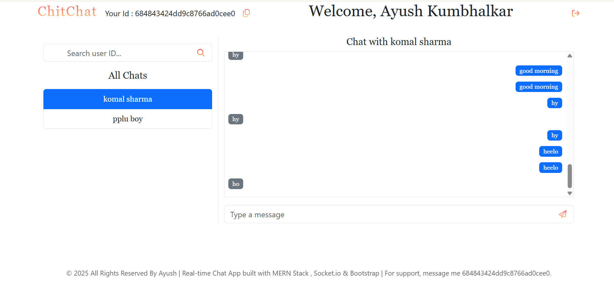
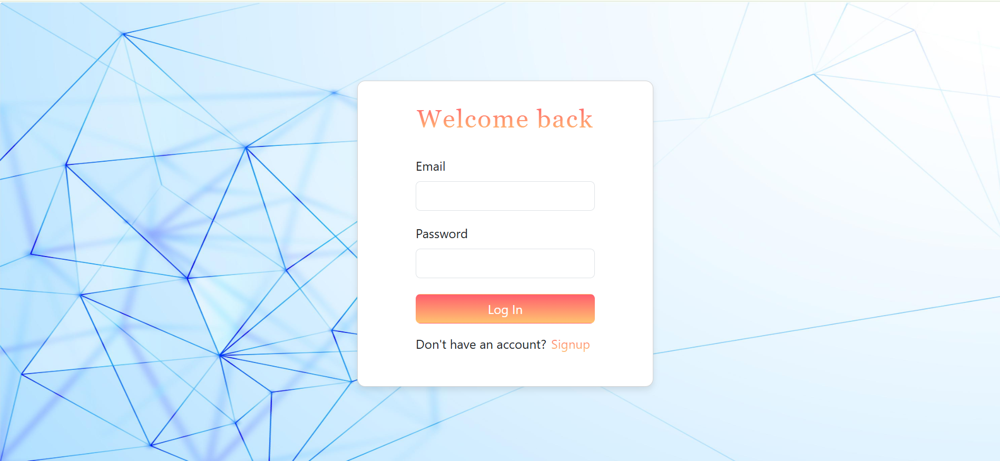
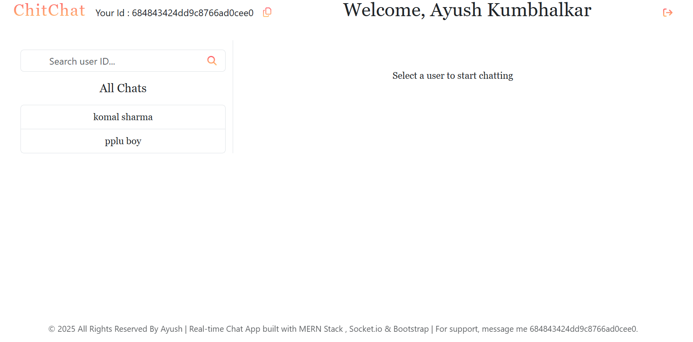
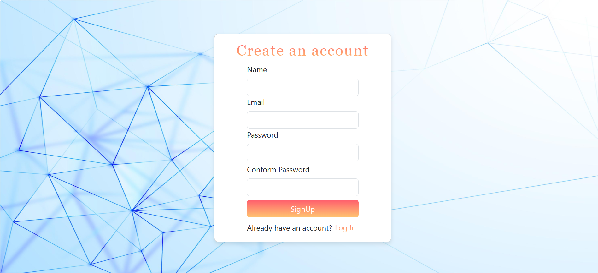

# 💬 ChitChat - Real-Time Chat App

A full-stack real-time chat application built using the MERN stack with Socket.io. Features include user authentication, private one-on-one messaging, and live message updates.

### 🔗 [Live Demo](https://message-chitchat.netlify.app/)  • [Backend GitHub](https://github.com/FrontendwithAyush/chat-app-backend)

---

## 🛠️ Tech Stack

- **Frontend:** React.js, Bootstrap, Axios
- **Backend:** Node.js, Express.js, MongoDB, JWT
- **Real-Time:** Socket.io
- **Authentication:** JWT Tokens
- **Testing Tools:** Thunder Client

---

## 📸 Preview




---

## ✨ Features

- 🔐 Secure Sign Up & Login (JWT-based)
- 👥 User Search by ID
- 💬 Real-time Messaging via Socket.io
- 🧠 Auto-scroll on new messages
- 🔍 Gradient-styled Search & Send Icons
- 📋 Copy-to-clipboard user ID
- 🚀 Smooth Loading Bar
- 📱 Responsive Bootstrap Design

---

## 🖼️ Screenshots

  <div align="center">



</div>

---

## 📁 Folder Structure

```bash
chitchat/
│
├── frontend/
│   ├── public/
│   ├── src/
│   │   ├── components/
│   │   ├── App.js
│   │   └── ...
│   └── package.json
│
├── backend/
│   ├── models/
│   ├── routes/
│   ├── middleware/
│   ├── socket.js
│   └── server.js
│
└── README.md
```

---

## 🚀 Getting Started

### 1. Clone Repositories

```bash
git clone [https://github.com/yourname/chitchat-frontend](https://github.com/FrontendwithAyush/Chat-App-Frontend)
git clone [https://github.com/yourname/chitchat-backend](https://github.com/FrontendwithAyush/chat-app-backend)
```

### 2. Setup Backend

```bash
cd chitchat-backend
npm install
```

- Create a `.env` file:

```env
PORT=5000
MONGO_URI=your_mongo_uri
JWT_SECRET=your_jwt_secret
```

- Start the server:

```bash
node server.js
```

### 3. Setup Frontend

```bash
cd chitchat-frontend
npm install
npm start
```

---

## 📌 How It Works

- Users log in or sign up.
- After login, users can search and chat with others using their User ID.
- Messages are sent in real-time using **Socket.io**.
- Messages are also saved in **MongoDB** using backend API.
- Smooth user experience with alerts, loading bars, and auto-scroll effects.

---

## 🧪 API Testing

- You can test the protected routes and login/signup using **Thunder Client** or **Postman**.
- Auth token is returned on login and stored in localStorage.

---

## 📞 Contact / Issues

For any concerns, feel free to reach out or raise an issue.  
💬 DM me 684843424dd9c8766ad0cee0 inside the app.

---


> © 2025 ChitChat by Ayush — built with ❤️ using the MERN stack.
